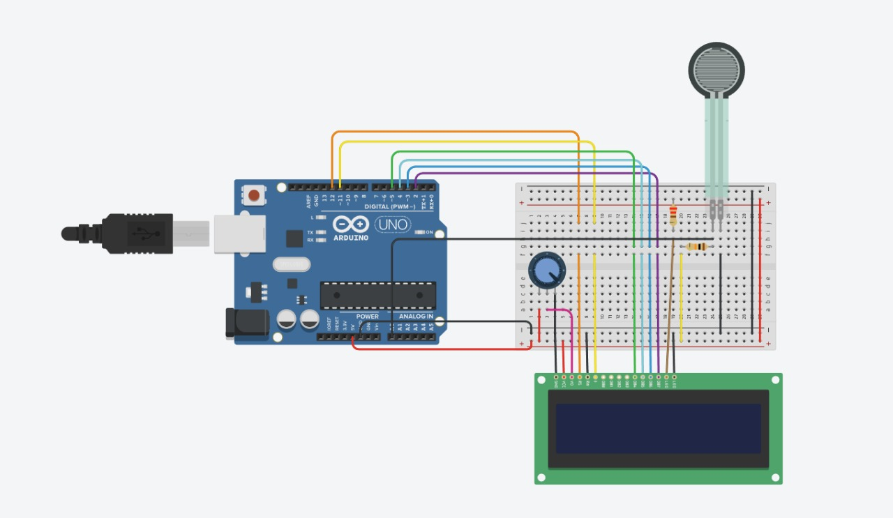
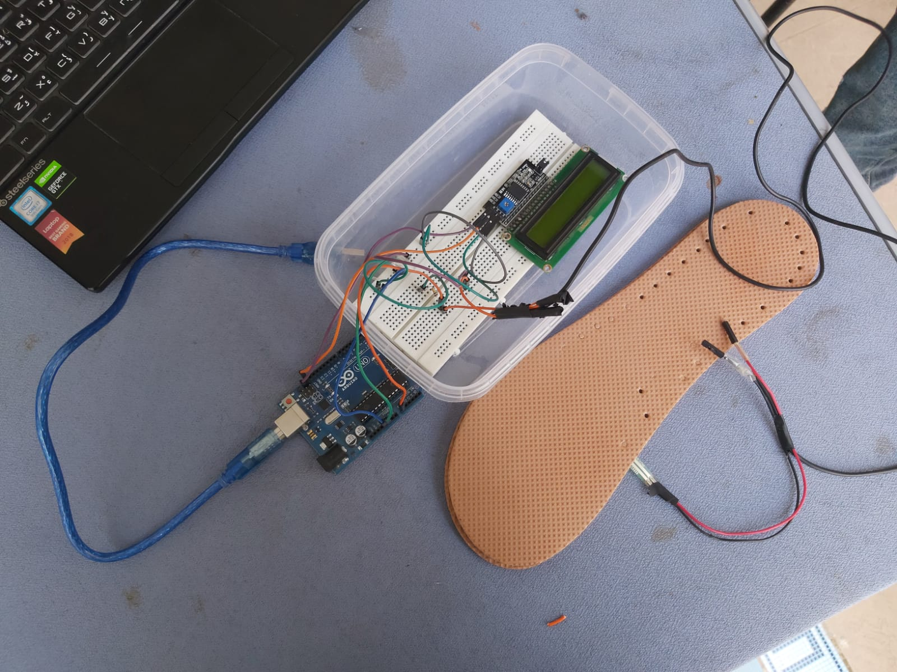
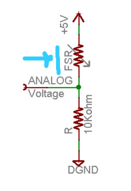

# Pressure monitor using arduino and FSR.
## **[To see Data sheet click here.](https://cdn-learn.adafruit.com/downloads/pdf/force-sensitive-resistor-fsr.pdf)**
## Hardware requirments:
<ol>
  <li>FSR </li>
  <li>Arduino Uno board + cable. </li>
  <li>16x2 LCD for displaying output. </li>
  <li>I2C chip for interfacing with the LCD. </li>
  <li>Fixed 10 KOhm resistor. </li>
  <li>A long wire to connect to the sensor.</li>
  <li>Some jumper cables (may not be necessary, see (potential) Future work.)</li>
  <li>Battery pack + USB cable (in case you need to make it wearable.)</li>
</ol>

## Summary

## Application: insole pressure monitor
The main purpose of this system is to monitor the change of pressure
inside the patient’s sole, which helps physical therapists with gait
analysis and performance monitoring.
Measuring the amount of force exerted by athletes in particular is
critical to monitoring their performance. (to put it simply, pressing
harder on the ground generally means more speed, height, etc.)
## Circuit Diagram

## Prototype photos

The sensor is sandwiched between these two soles which will then be inserted into the athlete/patient's shoes.

## Code parts
### What the code does:
1. Measure the voltage /resistance across the FSR (noted v_meas, r_meas respectively.)  

3. Calculate the force on the sensor in grams.

### Measuring the resistance of the FSR.

The method I'm using to measure the FSR is the voltage divider, we connect a 5v
source and a series resistor to the FSR, then we place an analog pin over the FSR
to measure its voltage and calculate the voltage, (which is v_meas in the code.)
see below for more details.     

this is meant to demonstrate the concept of analog voltage measurement, in the actual circuit however, I've switched up the places of the resistors, still, the analog voltage will be at the same place and the principle applies. 

### Calculating the force / pressure based on the resistance.
This part is mostly based on rough readings and calculations, for more accurate results you should check take a look at **[this](https://makersportal.com/blog/2020/5/24/force-sensitive-resistors-fsrs-arduino)**.  

*Note: the above link dives more in depth into calibrating the sensor by using known weights, measuring the resistance values and then using curve fitting to come up with the function linking between the resistance and force on the sensor.
the issue here (aside from the fact that he uses a different sensor.) is that I haven't verified this, and also I don't have enough known weights, curve fitting knowledge, or will to live to repeat this process for my sensor.*

For now, the function being used is just basic linear regression. I pulled the data points out of the data sheet which you can find linked above
Since the resistance is inversely proportional to the mass/force (and also spoiler alert: non-linear) it's really hard to get a good reading with this thing.

## (Potential) Future work
1. Claibrating the sensor agsint known weight.
2. Using this with a more portable configruation (arduino nano+ soldering)
3. Making a cool video tutorial about it.

I hope this tutorial was helpful, if you kept reading this far I would like to say "Have a nice day."
